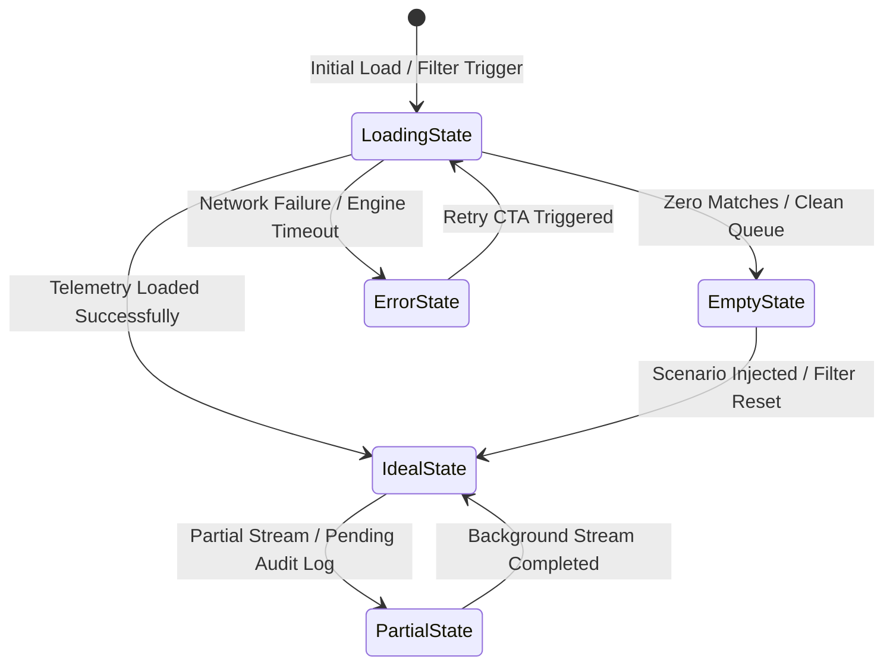

# TRACE-X: Design Specification & UI Architecture
## Financial Crime + Insider Risk Investigation Operating System

> **Design Directive:** Adhering strictly to `anti-ai-slop-design`, `curated-components-and-taste`, `product-ux-architecture`, and `modern-frontend-engineering`. TRACE-X is designed as an institutional sovereign banking intelligence cockpit. It eliminates generic SaaS cliches (no neon blobs, no purple/cyan gradients, no floating glass cards with muddy drop shadows) in favor of high-precision tactile surfaces, hairline borders, dense scannable data layouts, and physics-based micro-interactions.

---

## 1. Aesthetic Identity & Visual Language (per `anti-ai-slop-design`)

### 1.1 Archetype: Tactile Dark High-Precision Financial Intelligence
The visual archetype is rooted in defense-grade financial intelligence and regulatory forensics (FATF / RBI audit compliance). It conveys institutional gravity, absolute auditable precision, and calm clarity during high-stakes triage.

```
┌──────────────────────────────────────────────────────────────────────────┐
│ ARCHETYPE PILLARS                                                        │
│ • Domain: Anti-Money Laundering & Insider Threat Forensics              │
│ • Audience: Senior AML Investigators, Forensic Auditors, Fraud Officers │
│ • Emotional Tone: Rigorous, Sovereign, Impartial, High-Authority         │
│ • Typography: High-legibility grotesque sans paired with tabular mono    │
│ • Spatial Density: High-density split-pane cockpit with focused hierarchy │
└──────────────────────────────────────────────────────────────────────────┘
```

### 1.2 Inspiration Benchmarks
- **Dark.design:** Reference for layered deep-slate surfaces (`#070B12`, `#0D1526`, `#141F36`), subtle 1px translucent hairline borders, and optical edge reflections.
- **Supahero:** Clear visual hierarchy where the focal investigation narrative ("From employee privilege override to ₹9.7L cash-out") dominates without distraction.
- **Durves.com / Curved / Minimal:** Editorial layout discipline, generous breathing room around complex data structures, and sharp tabular alignment.
- **Call to Inspiration:** Real-world investigation patterns: synchronized dual-pane timeline and network graph, sticky evidence sidebars, and clear audit breadcrumbs.
- **Shader Gradient:** A subtle, dark mathematical grid canvas with extremely low opacity ($2\%$) ambient vignette that grounds the graph canvas without reducing text contrast.

### 1.3 Anti-AI-Slop Negative Constraints
| Prohibited AI-Slop Pattern | Replacement in TRACE-X |
| :--- | :--- |
| **Purple / Cyan Gradients** | Strict domain palette: Deep Navy, Slate, Signal Crimson, Alert Amber, Audit Emerald, and Muted Gold. |
| **Random Glowing Neon Blobs** | Crisp solid surfaces with 1px hairline borders (`border-white/[0.08]`) and layered dual-drop shadows. |
| **Floating Glassmorphic Cards** | Solid grounded cards (`bg-slate-900/90` with `backdrop-blur-sm`) attached to an explicit 12-column grid. |
| **Meaningless Badges ("★ AI-Powered")** | Functional, auditable status tags: `RULE_STRUC_01`, `TEMPORAL_PROX_88%`, `SEV_CRITICAL`. |
| **Repetitive 3-Column Feature Cards** | Asymmetrical, mission-driven cockpit layout: Command Bar + Interactive Graph Canvas + Synchronized Timeline + Evidence Ledger. |
| **Fake Testimonials / Metrics** | Real regulatory benchmarks (FATF RBA guidelines, RBI 2024 Staff Fraud Directions) and concrete telemetry numbers. |

### 1.4 Strict Color Palette & Semantic Tokens

```css
:root {
  /* Surfaces & Backgrounds */
  --bg-cockpit: #06090F;           /* Root canvas background */
  --bg-surface-1: #0B111E;         /* Panel and card backgrounds */
  --bg-surface-2: #121B2F;         /* Active/hovered card backgrounds */
  --bg-surface-elevated: #18243E;  /* Popovers, tooltips, dialogs */
  
  /* Hairline Borders & Dividers */
  --border-subtle: rgba(255, 255, 255, 0.07);
  --border-strong: rgba(255, 255, 255, 0.14);
  --border-focus: rgba(59, 130, 246, 0.5);

  /* Typography */
  --text-primary: #F1F5F9;         /* Slate-100: primary data and headlines */
  --text-secondary: #94A3B8;       /* Slate-400: descriptions, timestamps, labels */
  --text-muted: #64748B;           /* Slate-500: meta tags, inactive states */

  /* Entity & Domain Semantic Accents */
  --accent-employee: #38BDF8;      /* Sky-400: Employee & Privilege nodes */
  --accent-customer: #818CF8;      /* Indigo-400: Customer & Account nodes */
  --accent-transaction: #FBBF24;   /* Amber-400: Financial transactions & money flow */
  --accent-risk-critical: #EF4444; /* Rose-500: Severe laundering / fraud */
  --accent-risk-high: #F97316;     /* Orange-500: High anomaly score */
  --accent-risk-medium: #F59E0B;   /* Amber-500: Moderate deviation */
  --accent-legitimate: #10B981;    /* Emerald-500: Cleared / Benign baseline */

  /* Dual Layered Shadow System */
  --shadow-tactile: 0 1px 2px rgba(0, 0, 0, 0.4), 0 8px 24px rgba(0, 0, 0, 0.6);
  --shadow-node: 0 0 0 1px rgba(255, 255, 255, 0.08), 0 4px 16px rgba(0, 0, 0, 0.5);
}
```

---

## 2. Prebuilt Component Blueprint (per `curated-components-and-taste`)

To guarantee production accessibility, keyboard navigation, and world-class craft, TRACE-X directly integrates battle-tested primitives from leading design libraries.

### 2.1 Shadcn UI (Structural & Accessible Foundation)
* **Tabs (`@radix-ui/react-tabs`):** View switcher in the Case Investigation Studio (`Graph Topology`, `Attack Timeline`, `Evidence Ledger`, `Counterfactual Sandbox`).
* **Dialog & Sheet (`@radix-ui/react-dialog`):**
  - Right slide-over **Investigator Copilot Drawer** with zero layout shift.
  - Entity inspection modal displaying raw KYC records, employee access logs, and transaction hashes.
* **DropdownMenu & Select (`@radix-ui/react-dropdown-menu`):** Triage status dropdown (`NEW`, `UNDER_REVIEW`, `ESCALATED`, `FALSE_POSITIVE`, `CONFIRMED`) and scenario switcher.
* **DataTable (`@tanstack/react-table` + Shadcn):**
  - **Investigation Queue:** Sortable, filterable case list with risk score, evidence tags, age, and assigned investigator.
  - **Scenario Lab Benchmark Matrix:** Dynamic comparison table showing Typology, Ground Truth, Detection Result, and Latency.
* **Accordion (`@radix-ui/react-accordion`):** Expandable evidence cards grouping individual claims by the 7 detection engines with collapsible JSON payloads.
* **Command Palette (`cmdk`):** `Ctrl+K` / `Cmd+K` global spotlight navigation to jump directly to any Case (`TX-48291`), Employee (`E104`), Customer (`C782`), or Account (`A221`).
* **Badge & Tooltip (`@radix-ui/react-tooltip`):** Micro-labels for permission codes (`P17: BENEFICIARY_OVERRIDE`) and temporal delta badges (`Δt: 17 mins`).

### 2.2 Magic UI (High-Impact Visual Elements)
* **Bento Grid:** Command Center Executive Overview displaying 4 key metric tiles:
  - Active Cases & Risk Exposure (₹ Total at Risk).
  - Telemetry Ingestion Rate (Tx/sec & Audit events/sec).
  - Privilege-to-Proceeds Correlation Velocity.
  - Model Precision & False Positive Rate Benchmark.
* **Animated Beam:** Dynamic SVG beam tracing the exact causal money path across the network:
  `Employee E104 ──> Customer C782 ──> Beneficiary B992 ──> Account A221 ──> Mule A391`.
* **Border Beam:** Subtle, continuous 1px traveling border highlight encircling the active High-Risk Case card to immediately draw investigator attention.
* **Shimmer Button:** High-priority action buttons:
  - "Run Counterfactual Simulation"
  - "Generate Audit Evidence Dossier (PDF)"
* **Marquee:** Subdued real-time activity ticker at the bottom of the Command Center displaying live simulated transactions and access events.

### 2.3 Aceternity UI (Immersive Spatial Motion)
* **Tracing Beam:** The vertical attack-path timeline component that illuminates sequentially as the investigator scrolls through the chronologically ordered causal events.
* **3D Card Effect:** Subtle gyroscope/mouse-tracking tilt applied to the Evidence DNA card, giving tactile physical depth to risk factor segments.
* **Subtle Mathematical Background Grid:** Tactile, precise 24px coordinate grid pattern positioned behind the graph canvas to provide forensic workstation ambiance.

### 2.4 Uiverse.io (Creative Micro-Components)
* **Tactile Toggle Switch:** High-contrast physical switch for the Counterfactual Engine: `[ Remove Employee Intervention ]`.
* **Radar Pulse Loader:** Live telemetry listening badge displaying a pulsating amber radar blip indicating real-time stream ingestion.
* **Scenario Chip Selector:** Tactile radio cards for selecting synthetic test typologies in the Scenario Lab.

---

## 3. Emil Kowalski Micro-Interactions & Impeccable Taste

### 3.1 Physics-Based Springs Over Linear Easing
All animated state changes utilize natural spring physics:
- **Button Clicks & Chips:** `stiffness: 500, damping: 30` (snappy, responsive, zero wobble).
- **Drawer & Modal Transitions:** `stiffness: 320, damping: 28` (smooth organic deceleration).
- **Graph Node Selection & Focus:** `stiffness: 260, damping: 20` (gentle camera glide).

### 3.2 Tactile Feedback & Active States
Every interactive element features physical pushback:
```css
.interactive-tactile {
  transition: transform 0.12s cubic-bezier(0.16, 1, 0.3, 1), 
              background-color 0.15s ease, 
              border-color 0.15s ease;
}
.interactive-tactile:active {
  transform: scale(0.978);
}
```

### 3.3 Spatial Continuity & Layout Morphing (FLIP)
- When clicking a node in the graph (e.g. `Customer C782`), the node highlights with a ring expansion, and the detail inspector slides in smoothly from the right with aligned coordinates.
- When toggling Counterfactual Mode, the removed node dissolves into dashed wireframes while downstream transaction edge weights visually contract to zero.

### 3.4 Micro-Typography Tuning & Optical Alignment
- **Tabular Numerics:** All currency figures (`₹9,70,000`), timestamps (`02:42:18 IST`), and scores (`94.2%`) strictly utilize `font-variant-numeric: tabular-nums` to eliminate horizontal layout jitter during updates.
- **Display Tracking:** Headlines (`text-2xl` and above) use `tracking-tight` (`-0.025em`) for punchy authority.
- **Metadata Labels:** Small caps labels (`text-[11px] font-semibold tracking-wider uppercase text-slate-400`).
- **Optical Centering:** Play/run icons (`▶`) in circular buttons are nudged `+1.5px` to the right to balance visual center-of-mass against geometric center.

### 3.5 Stacked Sonner-Style Toasts
- Non-blocking notification stack for triage decisions, case assignments, and PDF generation.
- Toasts scale down and peek beneath the active top notification with interactive swipe-to-dismiss.

---

## 4. The 5 Essential UI States (per `product-ux-architecture`)

Every view in TRACE-X explicitly defines and handles all 5 essential states:



### 4.1 Ideal State (Full Forensic Fidelity)
- **Investigation Studio Layout:**
  - **Left Pane (60%):** Interactive Heterogeneous Graph with custom styled nodes (Employee avatar with role tag, Customer node with KYC status, Beneficiary node with approval icon, Transaction node with currency badge, Mule accounts with network density rings).
  - **Right Pane (40%):** Synchronized tabbed inspector featuring the vertical Attack Timeline, the 7-segment Evidence DNA meter, and expandable Evidence Claim cards.
- **Top Bar:** Case Header (`CASE #TX-48291 HIGH RISK`), Composite Score Gauge (`94.2 / 100`), Confidence Level (`0.91`), and one-click actions (`Counterfactual`, `Generate PDF`, `Escalate`).

### 4.2 Empty State (Actionable & Contextual)
- **Investigation Queue Empty:** When all alerts are triaged:
  - Displays a clean dark container with a subtle SVG radar scanner illustration.
  - Text: *"All incoming alerts have been triaged. No unassigned cases pending review."*
  - Primary CTA: Shimmer Button `[ Inject Synthetic Fraud Scenario ]` linking directly to the Scenario Lab.
- **Filtered Search Empty:**
  - Text: *"No transactions found matching amount > ₹5,00,000 for this account."*
  - CTA: Subtle button `[ Reset Active Filters ]`.

### 4.3 Loading State (Zero Layout Shift)
- Complete skeleton screens matching the exact DOM geometry of the loaded view:
  - Graph canvas shows subtle pulsating node circles and connecting hairline wireframes.
  - Timeline displays 5 vertical skeleton event cards with date stamps.
  - Evidence pane displays 4 accordion skeleton bars.
- Zero layout shift (CLS = 0) upon transition from loading to rendered content.

### 4.4 Error State (Defensive & Recoverable)
- When backend graph computation or API fails:
  - Card with hairline amber/rose border: *"Graph Analytics Engine Unavailable"*.
  - Explains the specific failure (e.g. *"Temporal sequence computation timed out for Case TX-48291"*).
  - Diagnostic copy with error reference code: `ERR_TEMPORAL_GRAPH_TIMEOUT`.
  - Recovery action: Tactile button `[ Re-run Graph Correlation ]` with auto-retry countdown.

### 4.5 Partial State (Graceful Stream Degradation)
- Triggered when transaction data is present, but insider access audit logs are still ingesting:
  - Displays the transaction and account nodes with full fidelity.
  - Employee and Privilege nodes render with a subtle dashed amber border and a localized pulsating badge: *"Awaiting IAM Audit Ingestion (24/30 events synced)"*.
  - Risk score displays an advisory note: *"Provisional Score (82% complete)"*.

---

## 5. Screen-by-Screen Layout Specifications

### Screen 1: Command Center (Executive Overview & Triage)
- **Top Nav:** TRACE-X Logo with glowing green telemetry status badge (`STREAM ACTIVE`), global `Cmd+K` search bar, and system clock (IST).
- **Row 1 (Bento Grid):**
  - Tile 1 (Span 4): Active Cases Breakdown (Critical: 3, High: 6, Medium: 8, Cleared: 42).
  - Tile 2 (Span 4): Potential Financial Exposure (₹4.72 Crores across active attack chains).
  - Tile 3 (Span 4): Model Health & False Positive Benchmark (FPR: 4.2%, Precision: 96.1%).
- **Row 2:** Live Investigation Queue (DataTable) with columns: `Case ID`, `Typology`, `Primary Employee`, `Customer / Beneficiary`, `Exposure (INR)`, `Evidence DNA`, `Risk Score`, `Status`, `Action`.
- **Bottom:** Subdued streaming Marquee with live synthetic events.

### Screen 2: Investigation Studio (The Centerpiece)
- **Split View:**
  - **Left 65%:** Interactive Cytoscape / React Flow Graph Canvas. Floating controls in top-left (Zoom, Fit, Layout Toggle, Physics Freeze, Layer Filter: Hide/Show Devices, Employees, Transactions).
  - **Right 35%:** Tabbed Evidence Cockpit:
    - *Tab 1: Evidence DNA & Claims:* Color-coded 7-engine breakdown + expandable claim cards with source event IDs.
    - *Tab 2: Attack Timeline:* Synchronized vertical tracing beam chronologically connecting every action.
    - *Tab 3: Investigator Copilot:* Grounded chat interface with quick prompts (*"Summarize privilege misuse"*, *"Check mule account link"*).

### Screen 3: Counterfactual Sandbox ("What-If" Explorer)
- Interactive simulation interface:
  - Side-by-side graph view: `Observed Reality` vs `Counterfactual Reality`.
  - Toggle Switch: `[ Remove Employee Intervention (E104) ]`.
  - Live Differential Metrics:
    - Original Risk: `94.2%` ➔ Counterfactual Risk: `11.5%` ($\Delta -82.7\%$).
    - Causal Verdict: *"Employee intervention is structurally necessary to complete the laundering pathway."*

### Screen 4: Scenario Lab & Benchmark Testbed
- Grid of pre-baked synthetic test cards:
  - `SCN_INSD_01`: Privilege-to-Proceeds Beneficiary Fraud (Suspicious).
  - `SCN_STRUC_02`: Multi-Branch Cash Smurfing (Suspicious).
  - `SCN_DORM_03`: Dormant Account Awakening & Drain (Suspicious).
  - `SCN_LEGIT_04`: High-Value Seasonal Business Surge (Legitimate Twin).
  - `SCN_LEGIT_05`: Standard Corporate Salary Disbursement (Legitimate Twin).
- Action: Shimmer Button `[ Execute All Scenarios & Generate Benchmark Matrix ]`.
- Output: Confusion Matrix, ROC-AUC curve, and latency distribution.

### Screen 5: Auditable Compliance Dossier (Export Modal & Print View)
- Institutional, clean-lined, printable report formatted for compliance officers:
  - Header: Bank Seal, Case Reference, Date, Audit Classification.
  - Section 1: Executive Summary & Attack Chain Narrative.
  - Section 2: Detailed Entity Roster (Employee, Customer, Accounts, Beneficiary).
  - Section 3: Chronological Forensic Timeline with Event IDs and Timestamps.
  - Section 4: Deterministic Evidence DNA & Mathematical Deviation Multipliers.
  - Section 5: Counterfactual Dependency Proof.
  - Section 6: Investigator Sign-off & Hash Verification.

---

## 6. Implementation Technical Stack Alignment
- **Styling Engine:** Tailwind CSS 3.4+ with custom semantic variables in `globals.css`.
- **Component Primitives:** `@radix-ui` primitives styled with Tailwind (Shadcn UI standard).
- **Icons:** `lucide-react` for consistent, crisp, accessible iconography.
- **Graph Visualization:** `@xyflow/react` (React Flow v12) with custom nodes (`EmployeeNode`, `CustomerNode`, `AccountNode`, `TransactionNode`) and animated bezier edges.
- **Animation:** `framer-motion` for spring physics, layout morphing, and drawer entries.
- **Table:** `@tanstack/react-table` for high-performance sortable triage tables.
