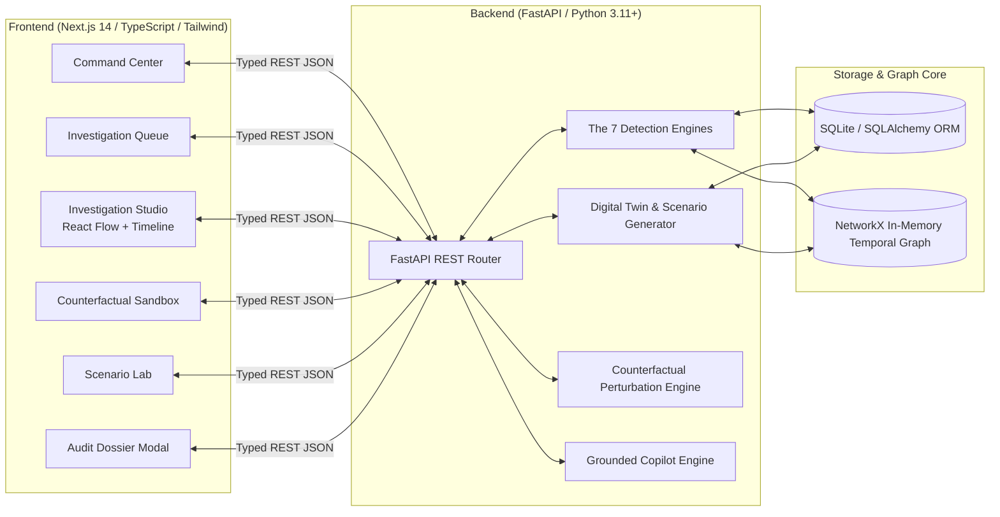
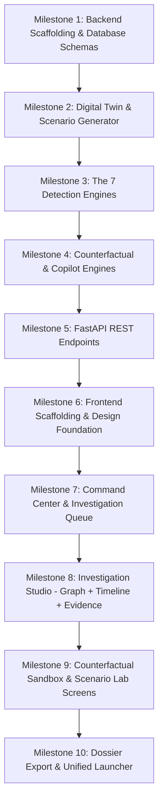

# TRACE-X: Complete Software Implementation Master Plan
## End-to-End Build Blueprint (Pure Construction & Delivery)

> **Notice:** Per user directive, all automated testing, unit test suites, and cross-checking steps are deferred. This master plan focuses purely on building the complete, fully functional software end-to-end so that the user can manually inspect and explore the system first.

---

## 1. System Architecture Overview

TRACE-X is structured as a high-performance monorepo uniting an asynchronous Python analytics engine with a high-density Next.js investigation studio:



---

## 2. Phase-by-Phase Construction Blueprint

### Phase 1: Workspace & Monorepo Scaffolding
* **Objective:** Establish the directory structure, dependencies, and environment files for both backend and frontend.
* **Deliverables:**
  - `backend/requirements.txt`: FastAPI, Uvicorn, SQLAlchemy, Pydantic, NetworkX, NumPy, Pandas, Scikit-learn.
  - `frontend/package.json`: Next.js 14 App Router, React 18, `@xyflow/react`, Tailwind CSS, `lucide-react`, `framer-motion`, `@tanstack/react-table`, `@radix-ui` primitives.
  - `run.bat` / `run.ps1`: Single-command launcher script to boot both servers concurrently.

---

### Phase 2: Database Schemas & Core Data Models
* **Objective:** Implement the relational and graph data models defined in `MASTER_PLAN.md` and `DESIGN.md`.
* **Deliverables:**
  - `backend/app/core/config.py`: Application settings, CORS origins, AML threshold constants (e.g. ₹50K PAN threshold, ₹10L structuring limit).
  - `backend/app/core/database.py`: SQLAlchemy async/sync session management and SQLite database initialization (`tracex.db`).
  - `backend/app/models/ddl.py`: SQLAlchemy ORM models:
    - `Employee`, `Role`, `Permission`, `RolePermission`
    - `Customer`, `Account`, `Beneficiary`
    - `Transaction`
    - `EmployeeActivityLog`
    - `Case`, `Alert`, `EvidenceItem`
  - `backend/app/models/schemas.py`: Pydantic v2 schemas for all API payloads and graph visualizations.

---

### Phase 3: Digital Financial Crime Twin & Benchmark Generator
* **Objective:** Provide a rich, instant banking world with 187 employees, 8,431 customers, 2,417 transactions, and pre-injected showcase cases.
* **Deliverables:**
  - `backend/app/scenarios/definitions.py`: Pre-baked scenario templates:
    1. `SCN_INSD_01` (Showcase Case #TX-48291): Privilege-to-Proceeds Beneficiary Manipulation (Employee E104, Customer C782, Beneficiary B992, ₹9.7L transfer split across 2 mules).
    2. `SCN_STRUC_02`: Multi-Branch Cash Structuring / Smurfing below ₹50,000 PAN limit.
    3. `SCN_DORM_03`: Dormant Account Awakening (240 days inactive, unlocked by RM, drained offshore).
    4. `SCN_MULE_04`: Fan-In / Fan-Out Rapid Aggregation & Dispersion.
    5. `SCN_LEGIT_05`: High-Value Festive Business Surge (Legitimate Twin Control).
    6. `SCN_LEGIT_06`: Standard Corporate Salary Disbursement (Legitimate Twin Control).
  - `backend/app/scenarios/generator.py`: Synthetic generator creating realistic names, Indian IFSC/account numbers, realistic timestamps, and correlated logs.
  - `backend/app/utils/seed_data.py`: CLI seeding script that populates the database on first boot.

---

### Phase 4: The 7 Specialized Analytical Engines
* **Objective:** Implement the mathematical formulas and graph traversal logic for all 7 detection engines.
* **Deliverables:**
  1. `backend/app/engines/transaction_anomaly.py` (Engine 1):
     - Structuring window detector ($0.85 \cdot L \le \text{amount} < L$).
     - Cycle detector using Tarjan's strongly connected components on transaction graphs.
     - Fan-in / Fan-out degree burst analyzer.
     - Dormant reactivation detector ($\Delta t_{\text{dormant}} > 180\text{ days}$).
  2. `backend/app/engines/customer_baseline.py` (Engine 2):
     - Historical transaction amount $Z$-score calculation.
     - Benford's first-digit anomaly check.
     - Channel and geographic deviation scoring.
  3. `backend/app/engines/insider_behavior.py` (Engine 3):
     - Off-hours shift access detector (access outside 09:00–18:00).
     - Device & IP address deviation detector.
     - Servicing relationship boundary check (unassigned customer touched).
  4. `backend/app/engines/privilege_risk.py` (Engine 4):
     - Permission capability score: $\text{CapScore} = 1 - \prod (1 - w(p))$.
     - Attack surface mapping (identifies which exact permissions made the attack feasible).
  5. `backend/app/engines/money_flow_graph.py` (Engine 5):
     - In-memory `NetworkX` temporal multi-directed graph builder.
     - Multi-hop traversal connecting source customer to downstream mule accounts.
     - Device/IP overlap detection between employee and transaction recipients.
  6. `backend/app/engines/temporal_correlation.py` (Engine 6):
     - Causal chain matcher: $E_{\text{login}} \to E_{\text{access}} \to E_{\text{kyc\_mod}} \to E_{\text{beneficiary}} \to T_{\text{out}} \to T_{\text{mule\_split}}$.
     - Exponential time decay score: $S = \exp(-\lambda \Delta t)$ ($\lambda = 0.015$, $\Delta t = 17\text{ min} \implies S = 0.88$).
  7. `backend/app/engines/explainability.py` (Engine 7):
     - Deterministic Evidence DNA synthesis (7 color-coded dimensions).
     - Composite risk score calculator ($0 - 100$) and confidence metric ($0.0 - 1.0$).
     - Audit claim generator linking claims directly to source event IDs (`EVT-8821`, `TX-99182`).

---

### Phase 5: Advanced Differentiators
* **Objective:** Implement the three flagship features that elevate TRACE-X above conventional AML tools.
* **Deliverables:**
  1. `backend/app/engines/counterfactual.py` (**Counterfactual Sandbox Engine**):
     - Graph perturbation logic: $G' = G \setminus \{e_{\text{insider}}\}$.
     - Re-evaluates path reachability and automated KYC rules.
     - Computes $\Delta \text{Risk} = \text{Risk}(G) - \text{Risk}(G')$ (e.g. $94.2 \to 11.5$).
     - Returns structural dependency proof verdict.
  2. `backend/app/engines/copilot.py` (**Investigator Copilot Assistant**):
     - Strict Evidence-Store query engine.
     - Synthesizes answers strictly from verified `EvidenceItem` records with zero hallucination.
     - Supports natural prompts: *"Why was this case flagged?"*, *"What privilege did the employee use?"*, *"Summarize for senior audit"*.
  3. `backend/app/scenarios/benchmark.py` (**Scenario Benchmark Matrix**):
     - Runs the suite of 5 suspicious and 4 legitimate scenarios.
     - Computes real-time True Positives, True Negatives, False Positives, False Negatives, Precision, Recall, and F1.

---

### Phase 6: FastAPI REST API Layer
* **Objective:** Expose clean, strongly typed REST endpoints for all frontend features.
* **Deliverables:**
  - `backend/app/main.py`: FastAPI application setup, CORS middleware, error handlers.
  - `backend/app/api/cases.py`:
    - `GET /api/v1/cases`: Paginated case triage list with risk scores and Evidence DNA.
    - `GET /api/v1/cases/{id}`: Detailed case dossier.
    - `PATCH /api/v1/cases/{id}/status`: Status transition (`NEW` ➔ `UNDER_REVIEW` ➔ `ESCALATED`).
  - `backend/app/api/graph.py`:
    - `GET /api/v1/cases/{id}/graph`: React Flow nodes and edges with layout coordinates.
    - `GET /api/v1/cases/{id}/timeline`: Chronologically ordered attack chain events.
  - `backend/app/api/counterfactual.py`:
    - `POST /api/v1/cases/{id}/counterfactual`: Simulates removal of employee events/nodes.
  - `backend/app/api/scenarios.py`:
    - `GET /api/v1/scenarios`: List all pre-baked scenarios.
    - `POST /api/v1/scenarios/{id}/run`: Ingest and run detection pipeline on a scenario.
    - `GET /api/v1/scenarios/benchmark`: Returns confusion matrix and accuracy metrics.
  - `backend/app/api/copilot.py`:
    - `POST /api/v1/cases/{id}/copilot`: Q&A against the case evidence store.
  - `backend/app/api/reports.py`:
    - `GET /api/v1/cases/{id}/export-json`: Raw audit dossier data for export.

---

### Phase 7: Frontend Architecture & Foundation (per `DESIGN.md`)
* **Objective:** Initialize the Next.js 14 App Router frontend matching the tactile dark aesthetic.
* **Deliverables:**
  - `frontend/src/app/globals.css`: Dark palette (`#06090F`), hairline borders (`border-white/[0.08]`), layered shadows, and tabular numbers.
  - `frontend/src/app/layout.tsx`: Root shell with dark-mode theme, institutional header, and system navigation.
  - `frontend/src/components/layout/Header.tsx`: Top bar with TRACE-X logo, live telemetry pulse blip, global search trigger (`Cmd+K`), and Indian Standard Time clock.
  - `frontend/src/components/layout/Sidebar.tsx`: Navigation rail (`Command Center`, `Investigation Queue`, `Scenario Lab`, `Counterfactual Sandbox`).
  - `frontend/src/lib/api.ts`: Typed fetch client connecting to FastAPI at `http://localhost:8000`.
  - `frontend/src/types/index.ts`: TypeScript interfaces mirroring all Pydantic schemas.

---

### Phase 8: Frontend Screen Construction (6 Core Views)
* **Objective:** Build all 6 responsive screens using prebuilt components and Emil Kowalski micro-interactions.
* **Deliverables:**

  1. **Screen 1: Command Center (`/`)**
     - Bento Grid KPI cards (Active Cases, Potential Financial Exposure ₹4.72Cr, Telemetry Rate, False Positive Rate 4.2%).
     - Border Beam highlight on active High-Risk case alert.
     - Live simulated telemetry Marquee ticker.
     - Quick Triage DataTable preview.

  2. **Screen 2: Investigation Queue (`/cases`)**
     - Full-featured DataTable (`@tanstack/react-table`).
     - Columns: Case ID, Severity, Typology, Employee, Customer, Exposure (INR), Evidence DNA bars, Risk Score, Status.
     - Filter bar (Severity, Typology, Status) and search input.
     - One-click row navigation to Case Investigation Studio.

  3. **Screen 3: Investigation Studio (`/cases/[id]`) [THE CENTERPIECE]**
     - **Header Bar:** Case #TX-48291, Composite Risk Gauge (94.2/100), Confidence Badge (0.91), Quick Status Dropdown, and Action Buttons (`Counterfactual`, `Export Dossier`).
     - **Left Canvas (65%):** `@xyflow/react` Interactive Graph:
       - Custom nodes: `EmployeeNode`, `CustomerNode`, `BeneficiaryNode`, `AccountNode`, `TransactionNode`, `MuleNode`.
       - Animated bezier edges representing money flow and access privileges.
       - Mini-map, zoom controls, and layer toggle (hide/show device or access nodes).
     - **Right Cockpit (35%):** Tabbed Inspector:
       - *Tab 1 (Evidence):* 7-segment Evidence DNA breakdown + expandable accordion claim cards with source event IDs.
       - *Tab 2 (Timeline):* Vertical Tracing Beam with chronologically ordered, timestamped events and delta-t markers.
       - *Tab 3 (Copilot):* Grounded Q&A assistant drawer with prompt suggestions.

  4. **Screen 4: Counterfactual Sandbox (`/sandbox` or `/cases/[id]/counterfactual`)**
     - Side-by-side or split visualizer: Observed Chain vs Counterfactual Chain.
     - Tactile Neumorphic Toggle: `[ Remove Employee Intervention (E104) ]`.
     - Risk Differential Gauge: Displays original risk (94.2%) vs counterfactual risk (11.5%) with a $\Delta -82.7\%$ drop.
     - Structural Dependency Proof card with clear causal breakdown.

  5. **Screen 5: Scenario Lab & Benchmark Testbed (`/scenarios`)**
     - Typology selection cards (Privilege-to-Proceeds, Smurfing, Dormant Account, Seasonal Surge, Salary Disbursement).
     - Shimmer Button: `[ Run Scenario Simulation ]`.
     - Real-time Benchmark Matrix table comparing Ground Truth vs System Result (TP, TN, FP, FN).
     - Accuracy & False Positive metrics summary.

  6. **Screen 6: Compliance Audit Dossier (Printable Modal & View)**
     - Formal, clean-lined audit report modal for regulatory officers (FATF / RBI format).
     - Contains: Executive summary, entity breakdown, complete chronological event table, Evidence DNA breakdown, counterfactual proof, and cryptographic audit hash.
     - One-click browser print / PDF export styling.

---

### Phase 9: End-to-End Orchestration & Single-Command Launcher
* **Objective:** Ensure the complete application boots effortlessly and runs smoothly as a unified package.
* **Deliverables:**
  - `start.ps1` / `start.bat`: Script that activates the Python virtual environment, seeds initial data if missing, launches FastAPI on `http://localhost:8000`, and starts Next.js on `http://localhost:3000`.
  - `README.md`: Crisp setup guide explaining architecture, data flow, how to run, and demo walkthrough instructions.

---

## 3. Implementation Order & Milestone Sequence



---

## 4. Deliverable File Inventory

```
TRACE-X/
├── backend/
│   ├── requirements.txt
│   └── app/
│       ├── main.py
│       ├── core/ (config.py, database.py)
│       ├── models/ (ddl.py, schemas.py)
│       ├── engines/ (transaction_anomaly.py, customer_baseline.py, insider_behavior.py,
│       │             privilege_risk.py, money_flow_graph.py, temporal_correlation.py,
│       │             explainability.py, counterfactual.py, copilot.py)
│       ├── scenarios/ (definitions.py, generator.py, benchmark.py)
│       ├── api/ (cases.py, graph.py, counterfactual.py, scenarios.py, copilot.py, reports.py)
│       └── utils/ (seed_data.py)
├── frontend/
│   ├── package.json
│   ├── tailwind.config.ts
│   ├── tsconfig.json
│   └── src/
│       ├── app/
│       │   ├── layout.tsx
│       │   ├── globals.css
│       │   ├── page.tsx (Command Center)
│       │   ├── cases/page.tsx (Investigation Queue)
│       │   ├── cases/[id]/page.tsx (Investigation Studio)
│       │   ├── sandbox/page.tsx (Counterfactual Explorer)
│       │   └── scenarios/page.tsx (Scenario Benchmark Lab)
│       ├── components/
│       │   ├── layout/ (Header.tsx, Sidebar.tsx)
│       │   ├── graph/ (InvestigationGraph.tsx, nodes/*.tsx)
│       │   ├── timeline/ (AttackTimeline.tsx)
│       │   ├── evidence/ (EvidenceDNA.tsx, EvidenceCards.tsx)
│       │   ├── copilot/ (CopilotDrawer.tsx)
│       │   └── dossier/ (AuditDossierModal.tsx)
│       ├── lib/ (api.ts, utils.ts)
│       └── types/ (index.ts)
├── start.ps1
└── README.md
```
