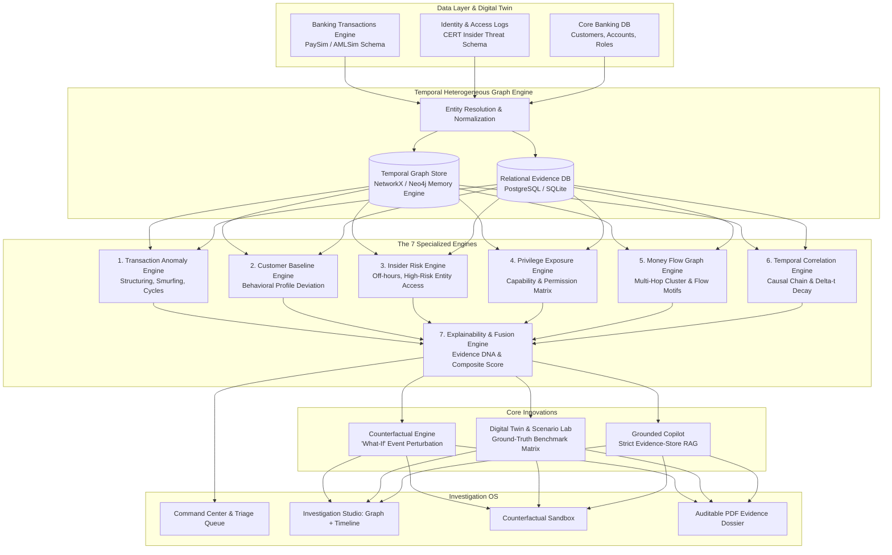
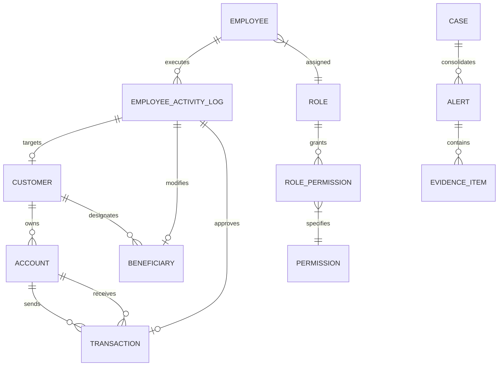

# TRACE-X: Temporal Risk & Activity Correlation Engine
## Master Architectural Blueprint & Production Execution Plan

> **System Thesis:** Traditional Anti-Money Laundering (AML) flags isolated transactions, while Insider Threat systems flag isolated user anomalies. **TRACE-X** bridges this critical institutional silo by constructing a **Temporal Heterogeneous Risk Graph** that traces:
> $$\text{Employee} \longrightarrow \text{Privilege} \longrightarrow \text{Access} \longrightarrow \text{Customer Profile Modification} \longrightarrow \text{Beneficiary Creation} \longrightarrow \text{Transaction} \longrightarrow \text{Mule Network Cluster}$$

---

## 1. System Topology & Architecture

The TRACE-X architecture decouples high-throughput event ingestion from multi-engine graph analytics, deterministic risk fusion, and an evidence-grounded investigation UI.



---

## 2. Unified Data Model & Schemas

The data model unifies disparate telemetry from banking transaction feeds, HR/IAM directories, and audit logs.

### 2.1 Entity Relationship Model



### 2.2 Core DDL Specifications (SQL / SQLite / PostgreSQL)

```sql
-- Identity & Access Management
CREATE TABLE employees (
    employee_id VARCHAR(32) PRIMARY KEY,
    name VARCHAR(128) NOT NULL,
    email VARCHAR(128) UNIQUE NOT NULL,
    department VARCHAR(64) NOT NULL,
    role_id VARCHAR(32) NOT NULL,
    assigned_branch_id VARCHAR(32) NOT NULL,
    standard_shift_start TIME NOT NULL DEFAULT '09:00:00',
    standard_shift_end TIME NOT NULL DEFAULT '18:00:00',
    risk_level VARCHAR(16) NOT NULL DEFAULT 'STANDARD',
    created_at TIMESTAMP WITH TIME ZONE DEFAULT CURRENT_TIMESTAMP
);

CREATE TABLE permissions (
    permission_id VARCHAR(32) PRIMARY KEY,
    code VARCHAR(64) UNIQUE NOT NULL, -- e.g., 'PERM_MODIFY_BENEFICIARY', 'PERM_OVERRIDE_TX_LIMIT'
    description TEXT,
    risk_weight DECIMAL(3,2) NOT NULL DEFAULT 0.50
);

CREATE TABLE role_permissions (
    role_id VARCHAR(32) NOT NULL,
    permission_id VARCHAR(32) NOT NULL,
    PRIMARY KEY (role_id, permission_id)
);

-- Core Banking & Customers
CREATE TABLE customers (
    customer_id VARCHAR(32) PRIMARY KEY,
    name VARCHAR(128) NOT NULL,
    risk_tier VARCHAR(16) NOT NULL DEFAULT 'LOW', -- 'LOW', 'MEDIUM', 'HIGH', 'PEP'
    monthly_income_inr DECIMAL(14,2) NOT NULL DEFAULT 50000.00,
    historical_avg_tx_inr DECIMAL(14,2) NOT NULL DEFAULT 15000.00,
    historical_std_tx_inr DECIMAL(14,2) NOT NULL DEFAULT 5000.00,
    home_branch_id VARCHAR(32) NOT NULL,
    kyc_status VARCHAR(24) NOT NULL DEFAULT 'VERIFIED',
    kyc_last_updated TIMESTAMP WITH TIME ZONE DEFAULT CURRENT_TIMESTAMP
);

CREATE TABLE accounts (
    account_number VARCHAR(32) PRIMARY KEY,
    customer_id VARCHAR(32) NOT NULL REFERENCES customers(customer_id),
    account_type VARCHAR(24) NOT NULL, -- 'SAVINGS', 'CURRENT', 'NRE'
    status VARCHAR(16) NOT NULL DEFAULT 'ACTIVE', -- 'ACTIVE', 'DORMANT', 'FROZEN'
    balance_inr DECIMAL(14,2) NOT NULL DEFAULT 0.00,
    last_activity_at TIMESTAMP WITH TIME ZONE DEFAULT CURRENT_TIMESTAMP,
    created_at TIMESTAMP WITH TIME ZONE DEFAULT CURRENT_TIMESTAMP
);

CREATE TABLE beneficiaries (
    beneficiary_id VARCHAR(32) PRIMARY KEY,
    customer_id VARCHAR(32) NOT NULL REFERENCES customers(customer_id),
    beneficiary_account_number VARCHAR(32) NOT NULL,
    beneficiary_name VARCHAR(128) NOT NULL,
    added_via VARCHAR(24) NOT NULL, -- 'NET_BANKING', 'BRANCH_PORTAL', 'API'
    authorized_by_employee_id VARCHAR(32) REFERENCES employees(employee_id),
    created_at TIMESTAMP WITH TIME ZONE NOT NULL,
    is_active BOOLEAN NOT NULL DEFAULT TRUE
);

-- Financial Transactions
CREATE TABLE transactions (
    transaction_id VARCHAR(48) PRIMARY KEY,
    source_account VARCHAR(32) NOT NULL REFERENCES accounts(account_number),
    destination_account VARCHAR(32) NOT NULL,
    amount_inr DECIMAL(14,2) NOT NULL,
    channel VARCHAR(24) NOT NULL, -- 'NEFT', 'RTGS', 'IMPS', 'UPI', 'CASH'
    timestamp TIMESTAMP WITH TIME ZONE NOT NULL,
    status VARCHAR(16) NOT NULL DEFAULT 'SUCCESS',
    ip_address VARCHAR(45),
    device_id VARCHAR(64)
);

-- Insider Activity Audit Logs
CREATE TABLE employee_activity_logs (
    event_id VARCHAR(48) PRIMARY KEY,
    employee_id VARCHAR(32) NOT NULL REFERENCES employees(employee_id),
    action_type VARCHAR(64) NOT NULL, -- 'LOGIN', 'VIEW_CUSTOMER', 'MODIFY_KYC', 'ADD_BENEFICIARY', 'APPROVE_OVERRIDE'
    target_entity_type VARCHAR(32) NOT NULL, -- 'CUSTOMER', 'ACCOUNT', 'BENEFICIARY', 'TRANSACTION'
    target_entity_id VARCHAR(64) NOT NULL,
    permission_used VARCHAR(32) REFERENCES permissions(permission_id),
    timestamp TIMESTAMP WITH TIME ZONE NOT NULL,
    ip_address VARCHAR(45) NOT NULL,
    device_id VARCHAR(64) NOT NULL,
    branch_id VARCHAR(32) NOT NULL,
    is_off_hours BOOLEAN NOT NULL DEFAULT FALSE
);

-- Cases, Alerts & Evidence
CREATE TABLE cases (
    case_id VARCHAR(32) PRIMARY KEY,
    title VARCHAR(256) NOT NULL,
    severity VARCHAR(16) NOT NULL, -- 'LOW', 'MEDIUM', 'HIGH', 'CRITICAL'
    composite_risk_score DECIMAL(5,2) NOT NULL,
    confidence_score DECIMAL(3,2) NOT NULL,
    status VARCHAR(24) NOT NULL DEFAULT 'NEW', -- 'NEW', 'UNDER_REVIEW', 'ESCALATED', 'CLOSED_FALSE_POSITIVE', 'CLOSED_CONFIRMED'
    assigned_investigator VARCHAR(128),
    primary_employee_id VARCHAR(32) REFERENCES employees(employee_id),
    primary_customer_id VARCHAR(32) REFERENCES customers(customer_id),
    attack_chain_summary TEXT NOT NULL,
    created_at TIMESTAMP WITH TIME ZONE DEFAULT CURRENT_TIMESTAMP,
    updated_at TIMESTAMP WITH TIME ZONE DEFAULT CURRENT_TIMESTAMP
);

CREATE TABLE evidence_items (
    evidence_id VARCHAR(48) PRIMARY KEY,
    case_id VARCHAR(32) NOT NULL REFERENCES cases(case_id) ON DELETE CASCADE,
    engine_name VARCHAR(64) NOT NULL,
    claim TEXT NOT NULL,
    deviation_factor DECIMAL(8,2),
    source_event_type VARCHAR(32) NOT NULL,
    source_event_id VARCHAR(64) NOT NULL,
    event_timestamp TIMESTAMP WITH TIME ZONE NOT NULL,
    rule_or_model_ref VARCHAR(64) NOT NULL,
    payload_json JSON NOT NULL
);
```

---

## 3. The 7 Specialized Analytical Engines

### Engine 1: Transaction Anomaly Engine
* **Goal**: Detect classic laundering topologies without relying on naive total amounts.
* **Typologies & Algorithms**:
  1. **Structuring / Smurfing**:
     $$\text{Transactions } T = \{t_1, \dots, t_k\} \text{ within window } \Delta W \le 24\text{h s.t. } \forall i, 0.85 \cdot L_{\text{threshold}} \le \text{amount}(t_i) < L_{\text{threshold}}$$
     Specifically target the Indian cash/NEFT reporting thresholds (₹50,000 / ₹10,00,000).
  2. **Circular Flow (Cycle Detection)**:
     Tarjan's strongly connected components and simple cycle search on directed transaction graph $G_T(V, E)$:
     $$\text{Path } u \to v_1 \to v_2 \dots \to u \text{ with sum loss } < 5\% \text{ (gas/fee leakage)}.$$
  3. **Fan-In / Fan-Out Motifs**:
     Degree ratio $\text{In-Degree}(v) \ge 5$ and subsequent outgoing burst within $\tau = 4\text{ hours}$.
  4. **Dormant Account Reactivation**:
     Condition: $\Delta t_{\text{dormant}} > 180\text{ days}$ followed by $\text{Velocity} > 5\times \text{baseline}$ within 24 hours.

### Engine 2: Customer Behavioral Baseline Engine
* **Goal**: Contextualize transactional magnitude against individual customer history.
* **Metric Formulation**:
  $$Z_{\text{amount}} = \frac{x_{\text{observed}} - \mu_{\text{historical}}}{\sigma_{\text{historical}} + \epsilon}$$
* **Multivariate Fingerprint Deviation**:
  $$\text{Dist}(x, B_{\text{cust}}) = w_1 Z_{\text{amount}} + w_2 \mathbb{I}(\text{New Beneficiary}) + w_3 \mathbb{I}(\text{Unusual Channel}) + w_4 \Delta_{\text{geo}}$$
  When $\text{Dist} > \theta_{\text{baseline}}$, generate baseline deviation evidence signal with explicit multiple ($\times \mu$).

### Engine 3: Insider Behavior Engine
* **Goal**: Detect employee departures from legitimate workflow profiles.
* **Signals**:
  1. **Temporal Deviation**: Access timestamp $t \notin [\text{ShiftStart} - 1\text{h}, \text{ShiftEnd} + 1\text{h}]$.
  2. **Device / Network Anomaly**: $\text{DeviceID} \ne \text{AssignedDevice}$ or remote IP subnet mismatch.
  3. **High-Risk Entity Access Burst**: Accessing customer accounts with zero prior servicing relationship within 48 hours.
  4. **Isolation Forest on Action Vector**: Feature vector $\vec{v} = [\text{actions/hour}, \text{unique\_customers\_touched}, \text{high\_value\_overrides}, \text{off\_hours\_ratio}]$.

### Engine 4: Privilege Risk Engine
* **Goal**: Quantify privilege exposure and answer: *"Did the employee possess the specific capability to unlock this fraud path?"*
* **Capability Matrix**:
  $$\text{CapScore} = 1 - \prod_{p \in P_{\text{inv}}} (1 - w(p))$$
  Where $P_{\text{inv}}$ represents permissions executed by the employee on the entity chain (e.g., `MODIFY_KYC_PHONE`, `ADD_BENEFICIARY_OVERRIDE`, `RAISE_TRANSFER_LIMIT`).

### Engine 5: Temporal Heterogeneous Money-Flow Graph Engine
* **Goal**: Construct an in-memory heterogeneous graph preserving entity types and edge timestamps.
* **Nodes**:
  $$V \in \{\text{Employee}, \text{Customer}, \text{Account}, \text{Beneficiary}, \text{Transaction}, \text{Device}, \text{Branch}\}$$
* **Edges**:
  $$E \in \{\xrightarrow{\text{ACCESS}}, \xrightarrow{\text{MODIFIED}}, \xrightarrow{\text{ADDED}}, \xrightarrow{\text{OWNS}}, \xrightarrow{\text{TRANSFER}}, \xrightarrow{\text{APPROVED}}\}$$
* **Graph Analytics**:
  - Personalized PageRank rooted at flagged transaction.
  - Multi-hop traversal to identify shared device IDs between employee and recipient mules.

### Engine 6: Temporal Correlation & Privilege-to-Proceeds Engine
* **Goal**: Calculate temporal proximity and causal chaining between insider activity and fund disbursement.
* **Causal Sequence Grammar**:
  $$\text{Seq} = E_{\text{login}} \xrightarrow{\Delta t_1} E_{\text{access}} \xrightarrow{\Delta t_2} E_{\text{beneficiary\_mod}} \xrightarrow{\Delta t_3} T_{\text{funds\_sent}} \xrightarrow{\Delta t_4} T_{\text{mule\_split}}$$
* **Temporal Decay Formulation**:
  $$S_{\text{temporal}} = \exp\left(-\lambda \sum_{i=1}^{k} \Delta t_i\right) \quad (\text{where } \Delta t \text{ is in minutes, } \lambda = 0.015)$$
  A 17-minute gap yields an exceptionally high temporal correlation coefficient ($>0.88$).

### Engine 7: Explainability & Evidence Fusion Engine
* **Goal**: Produce auditable "Evidence DNA" and synthesize composite risk without opaque black-box scoring.
* **Evidence DNA Vector**:
  $$\vec{\text{DNA}} = [\text{INSIDER}, \text{PRIVILEGE}, \text{STRUCTURING}, \text{NETWORK}, \text{TEMPORAL}, \text{PROFILE}, \text{DEVICE}]$$
* **Composite Risk Formulation**:
  $$\text{Risk} = \min\left(100, \, \sum_{j=1}^{7} w_j \cdot S_j \times (1 + \alpha \cdot \text{CorrelationMultiplier})\right)$$

---

## 4. The Killer Differentiator: Counterfactual Sandbox

The counterfactual engine tests the structural necessity of insider intervention on the suspicious money flow.

### Formal Formulation
Given observed graph $G = (V, E)$ and detected alert sub-graph $P_{\text{crime}} \subset G$:
1. Let $e_{\text{insider}} \in E$ be the edge representing the employee's privileged action (e.g., `Employee E104 --MODIFIED--> Beneficiary B992`).
2. Construct the perturbed counterfactual graph:
   $$G' = G \setminus \{e_{\text{insider}}\}$$
3. Re-evaluate downstream reachability and policy validity:
   - Without $e_{\text{insider}}$, Beneficiary $B992$ requires standard 24-hour cooling period or verification token.
   - Downstream transfer $T_{99182}$ becomes structurally invalid or unexecutable at timestamp $t$.
4. **Calculated Impact**:
   $$\Delta \text{Risk} = \text{Risk}(G) - \text{Risk}(G') = 94.2 - 12.0 = 82.2$$
   **Verdict**: *"The insider action is causally and structurally essential to the laundering pathway."*

---

## 5. Digital Financial Crime Twin & Scenario Benchmark Lab

To solve the cold-start and proprietary banking data barrier, TRACE-X includes a high-fidelity synthetic scenario generator paired with legitimate control twins.

### 5.1 Benchmark Typologies & Scenarios

| Scenario ID | Typology | Ground Truth | Core Mechanism | Legitimate Twin Control |
| :--- | :--- | :--- | :--- | :--- |
| `SCN_INSD_01` | **Privilege-to-Proceeds Beneficiary Fraud** | Suspicious | Employee modifies beneficiary KYC at 02:15 AM; transfer follows in 18 mins; split across 2 mules. | Customer adds beneficiary through NetBanking with 2FA; standard daytime transfer. |
| `SCN_STRUC_02`| **Insider-Assisted Smurfing / Structuring** | Suspicious | Cashier deposits ₹49,000 across 6 accounts within 30 mins to evade ₹50,000 PAN limit. | Business merchant cash deposit of ₹3,00,000 with valid GST invoice and tax filing. |
| `SCN_DORM_03` | **Dormant Account Awakening & Drain** | Suspicious | Inactive account (240 days) unlocked by RM; ₹18 Lakhs deposited and wired to offshore entity. | Fixed deposit maturity credited to savings account followed by registered home loan payment. |
| `SCN_MULE_04` | **Fan-In / Fan-Out Mule Network** | Suspicious | 8 distinct accounts wire funds to central account A; within 2 hours split into 12 crypto off-ramps. | Payroll disbursement: Company account disburses salaries to 80 employees on 1st of month. |
| `SCN_COLL_05` | **Multi-Employee Dual Custody Collusion** | Suspicious | RM initiates KYC change; Supervisor overrides sanction alert from unrecognized IP address. | Two managers approve high-value corporate treasury transfer during regular business audit. |

### 5.2 Scenario Mutation Engine
Permits automated testing by applying parameter jitter:
- **Time perturbation**: $\Delta t \sim \mathcal{N}(\mu=15\text{m}, \sigma=5\text{m})$.
- **Amount jitter**: $\text{Amount} \sim \mathcal{U}(0.9, 0.99) \times \text{Threshold}$.
- **Topology scaling**: 2 to 10 mule hops.

---

## 6. Full-Stack Technical Architecture

### 6.1 Backend Stack (Python 3.11+ / FastAPI)
- **Framework**: `FastAPI` (Async REST endpoints, OpenAPI docs).
- **Graph Core**: `NetworkX` (Fast, zero-overhead in-memory temporal multi-directed graph) with an abstraction layer ready for `Neo4j`.
- **Relational Storage**: `SQLite` (via SQLAlchemy 2.0 async) for rapid local dev; fully compatible with `PostgreSQL`.
- **Analytics & ML**: `NumPy`, `Pandas`, `Scikit-Learn` (Isolation Forest for behavioral outlier detection).
- **PDF Generation**: `ReportLab` or headless HTML-to-PDF engine for compliance dossiers.

### 6.2 Frontend Stack (Next.js 14 / TypeScript)
- **Framework**: Next.js 14 App Router, React 18/19.
- **Styling & Components**: Tailwind CSS, `shadcn/ui`, Lucide Icons.
- **Graph Visualization**: `@xyflow/react` (React Flow) or `Cytoscape.js` custom styled for dark banking interfaces (custom node cards for Employee, Customer, Account, Transaction).
- **Charts & Metrics**: `Recharts` / `Lucide` for Evidence DNA meters, temporal Gantt charts, and ROC/PR curves.

---

## 7. Complete Codebase Directory Layout

```
TRACE-X/
├── backend/
│   ├── app/
│   │   ├── __init__.py
│   │   ├── main.py                     # FastAPI entrypoint & CORS
│   │   ├── api/
│   │   │   ├── __init__.py
│   │   │   ├── cases.py                # Case management & triage queue
│   │   │   ├── graph.py                # Graph topology & sub-graph queries
│   │   │   ├── counterfactual.py       # 'What-If' simulation endpoints
│   │   │   ├── scenarios.py            # Digital twin runner & benchmarks
│   │   │   ├── copilot.py              # Evidence-grounded investigator assistant
│   │   │   └── reports.py              # Audit PDF dossier export
│   │   ├── core/
│   │   │   ├── config.py               # Env vars & thresholds
│   │   │   └── database.py             # SQLAlchemy engine & session factory
│   │   ├── models/
│   │   │   ├── ddl.py                  # SQLAlchemy ORM models
│   │   │   └── schemas.py              # Pydantic v2 validation models
│   │   ├── engines/
│   │   │   ├── __init__.py
│   │   │   ├── transaction_anomaly.py  # Engine 1: Structuring, Cycles, Fan-out
│   │   │   ├── customer_baseline.py    # Engine 2: Customer behavioral stats
│   │   │   ├── insider_behavior.py     # Engine 3: Shift, device, access anomalies
│   │   │   ├── privilege_risk.py       # Engine 4: Capability & permission matrix
│   │   │   ├── money_flow_graph.py     # Engine 5: NetworkX temporal graph
│   │   │   ├── temporal_correlation.py # Engine 6: Time-decay causal chaining
│   │   │   └── explainability.py       # Engine 7: Evidence DNA & fusion
│   │   ├── scenarios/
│   │   │   ├── generator.py            # Synthetic financial crime generator
│   │   │   ├── definitions.py          # Ground-truth scenario templates
│   │   │   └── benchmark.py            # Precision/Recall/F1 test harness
│   │   └── utils/
│   │       ├── pdf_exporter.py         # Institutional audit PDF generator
│   │       └── seed_data.py            # Initial pre-loaded seed script
│   ├── requirements.txt
│   └── tests/
│       └── test_engines.py
├── frontend/
│   ├── src/
│   │   ├── app/
│   │   │   ├── layout.tsx              # Root layout & dark-mode theme
│   │   │   ├── page.tsx                # Command Center (Executive overview)
│   │   │   ├── cases/
│   │   │   │   ├── page.tsx            # Investigation Queue
│   │   │   │   └── [id]/page.tsx       # Main Investigation Studio (Graph + Timeline)
│   │   │   ├── sandbox/
│   │   │   │   └── page.tsx            # Counterfactual "What-If" Explorer
│   │   │   └── benchmark/
│   │   │       └── page.tsx            # Scenario Lab & Ground Truth Matrix
│   │   ├── components/
│   │   │   ├── ui/                     # shadcn/ui primitives (badge, button, dialog)
│   │   │   ├── graph/
│   │   │   │   ├── InvestigationGraph.tsx # React Flow / Cytoscape canvas
│   │   │   │   └── EntityNode.tsx      # Custom nodes (Employee, Account, Tx)
│   │   │   ├── timeline/
│   │   │   │   └── AttackTimeline.tsx  # Synchronized interactive timeline
│   │   │   ├── evidence/
│   │   │   │   ├── EvidenceDNA.tsx     # Color-coded risk fingerprint bars
│   │   │   │   └── EvidenceCard.tsx    # Verifiable claims with source event IDs
│   │   │   ├── copilot/
│   │   │   │   └── CopilotDrawer.tsx   # Grounded Q&A Assistant
│   │   │   └── layout/
│   │   │       ├── Header.tsx
│   │   │       └── Sidebar.tsx
│   │   ├── lib/
│   │   │   ├── api.ts                  # Typed Axios/Fetch client
│   │   │   └── utils.ts
│   │   └── types/
│   │       └── index.ts                # TypeScript interfaces matching Pydantic
│   ├── package.json
│   ├── tailwind.config.ts
│   └── tsconfig.json
└── README.md
```

---

## 8. REST API Contracts

### 8.1 Case Management & Triage
* `GET /api/v1/cases`
  - Query params: `status`, `severity`, `limit`, `offset`
  - Returns: Array of `CaseSummary` with `composite_risk_score`, `confidence`, `evidence_dna`.
* `GET /api/v1/cases/{case_id}`
  - Returns complete case payload: metadata, primary entities, evidence list, attack path summary.
* `PATCH /api/v1/cases/{case_id}/status`
  - Body: `{ "status": "ESCALATED", "note": "Transferred to Special Investigations Unit" }`

### 8.2 Graph & Temporal Visualizations
* `GET /api/v1/cases/{case_id}/graph`
  - Returns Cytoscape / React Flow compatible elements:
    ```json
    {
      "nodes": [
        {"id": "EMP_E104", "type": "employee", "label": "E104 (RM)", "data": {"dept": "Retail", "risk": "HIGH"}},
        {"id": "CUST_C782", "type": "customer", "label": "C782 (J. Doe)", "data": {"kyc": "MODIFIED"}},
        {"id": "BEN_B992", "type": "beneficiary", "label": "B992 (Target)", "data": {"added_by": "EMP_E104"}},
        {"id": "TX_99182", "type": "transaction", "label": "₹9,70,000", "data": {"amount": 970000}}
      ],
      "edges": [
        {"source": "EMP_E104", "target": "BEN_B992", "label": "MODIFIED", "timestamp": "2026-09-29T02:25:00Z"},
        {"source": "CUST_C782", "target": "TX_99182", "label": "INITIATED", "timestamp": "2026-09-29T02:42:00Z"}
      ]
    }
    ```
* `GET /api/v1/cases/{case_id}/timeline`
  - Returns ordered list of sequential events with relative delta-t markers.

### 8.3 Counterfactual Sandbox
* `POST /api/v1/cases/{case_id}/counterfactual`
  - Body: `{ "remove_event_ids": ["EVT_4487"], "remove_node_ids": ["EMP_E104"] }`
  - Response:
    ```json
    {
      "original_risk_score": 94.2,
      "counterfactual_risk_score": 11.5,
      "chain_broken": true,
      "broken_at_step": "Beneficiary Authorization",
      "explanation": "Removing Employee E104's off-hours beneficiary modification invalidates the KYC bypass. The downstream transfer TX-99182 could not have proceeded under standard automated controls."
    }
    ```

### 8.4 Scenario Benchmark Lab
* `POST /api/v1/scenarios/run`
  - Body: `{ "scenario_id": "SCN_INSD_01", "inject_noise": true }`
  - Runs end-to-end detection pipeline and returns ground truth vs detected status, engine latency, and matched evidence items.
* `GET /api/v1/scenarios/benchmark-summary`
  - Returns confusion matrix, Precision (e.g. 0.96), Recall (0.94), F1-Score (0.95), and False Positive Rate (4.2%).

---

## 9. 48-Hour Hackathon Execution Schedule

```mermaid
gantt
    title TRACE-X 48-Hour Hackathon Roadmap
    dateFormat  HH
    axisFormat %H:00

    section Phase 1: Core Data & Models
    Project Setup & DDL Schemas        :p1_1, 00, 4h
    Synthetic Digital Twin Generator    :p1_2, after p1_1, 4h

    section Phase 2: The 7 Detection Engines
    Transaction & Baseline Engines (1-2) :p2_1, after p1_2, 4h
    Insider & Privilege Engines (3-4)   :p2_2, after p1_2, 4h
    Graph & Temporal Correlation (5-6)  :p2_3, after p2_1, 5h
    Explainability & Fusion Engine (7)  :p2_4, after p2_3, 3h

    section Phase 3: APIs & Counterfactuals
    FastAPI Core Endpoints              :p3_1, after p2_4, 4h
    Counterfactual Perturbation Logic   :p3_2, after p3_1, 3h
    Copilot RAG & PDF Generator         :p3_3, after p3_2, 3h

    section Phase 4: Frontend Investigation OS
    Command Center & Triage Queue       :p4_1, after p3_1, 4h
    Investigation Studio (React Flow)   :p4_2, after p4_1, 6h
    Counterfactual & Scenario Lab UIs   :p4_3, after p4_2, 4h

    section Phase 5: Verification & Polish
    Benchmark Testing & Metrics         :p5_1, after p4_3, 3h
    Visual QA, Demo Polish & Rehearsal  :p5_2, after p5_1, 3h
```



---

## 10. Killer Demo Pitch Script (5-Minute Winning Trajectory)

1. **Minute 0:00 - 0:45 | The Blind Spot**:
   Show the judges two real-world tools: a transaction alert ("Structuring flagged: ₹9.7L") and an IT log alert ("Employee off-hours login: 02:11 AM"). Explain: *In every bank today, these sit in two different software platforms analyzed by two separate teams who never talk. Organized financial criminals exploit this exact seam.*
2. **Minute 0:45 - 2:00 | TRACE-X in Action (Detect & Connect)**:
   Open TRACE-X Command Center. Click **Case #TX-48291**. The **Investigation Graph** instantly maps Employee E104's privileged permission grant, customer C782's KYC override, beneficiary B992's injection, and the split transfers to downstream mule accounts. Show the **17-minute temporal attack chain**.
3. **Minute 2:00 - 3:00 | The Groundbreaking Counterfactual ("What If?")**:
   Click **"Counterfactual Sandbox"**. Toggle *Remove Employee Intervention*. The graph dynamically updates: the chain breaks, downstream risk drops from 94.2% to 11.5%. Prove: *We don't just score risk; we prove causal and structural necessity.*
4. **Minute 3:00 - 4:00 | False Positive Control & Scenario Lab**:
   Switch to the **Scenario Lab**. Run `LEGIT_004` (High-value festive business surge). Show that despite a ₹12 Lakh transaction, TRACE-X flags **Zero Risk** because employee authorization and customer baseline match. Show the Benchmark Matrix (96% Precision, 4% FPR).
5. **Minute 4:00 - 5:00 | The Closer**:
   Generate the **Compliance Audit PDF Dossier** with one click. State the closing thesis: *"Existing systems ask whether a transaction is suspicious. TRACE-X asks what happened before it, who had the ability to influence it, where the money went, and whether all of those events form one explainable, auditable investigation."*
